```mermaid
mindmap
  root((Jierui))
    混吃技能
      单片机开发
      图像处理
      PCB设计
      FPGA（想学）
    外面溜达溜达
      广州
      佛山
      南京
    无聊翻的
      编码
      电路基础
      电子学
      C primer plus
      模拟CMOS集成电路设计
```

### Hi there 👋，I am ZI JIE(Jierui)
  
<!--
**JIERUI778/JIERUI778** is a ✨ _special_ ✨ repository because its `README.md` (this file) appears on your GitHub profile.

Here are some ideas to get you started:

- 🔭 I’m currently working on ...
- 🌱 I’m currently learning ...
- 👯 I’m looking to collaborate on ...
- 🤔 I’m looking for help with ...
- 💬 Ask me about ...
- 📫 How to reach me: ...
- 😄 Pronouns: ...
- ⚡ Fun fact: ...
-->
<!--
<div align="center">  </div>


<div align="center">  </div>


[](https://git.io/typing-svg)
-->
<!--
<br>
-->
<!--
<div align="center"><a href="https://blog.csdn.net/zhongzijie2004"></a>&emsp;</div>
-->
<!--
<div align="center" >

-->
<!--关系图-->

📊 **Today I Spent My Time On:**
<!--START_SECTION:waka-->
```txt
Markdown     2 hrs 56 mins   █████████████████████████   99.99 %
ObjectiveC   0 secs          ░░░░░░░░░░░░░░░░░░░░░░░░░   00.01 %
C            0 secs          ░░░░░░░░░░░░░░░░░░░░░░░░░   00.00 %
```
<!--END_SECTION:waka-->
<!--wakatime显示-->

<!--C语言图标-->
<!--python图标-->

<div style="display: flex; align-items: flex-start;"></div>
<div style="display: flex; align-items: flex-start;"></div>
<div style="display: flex; align-items: flex-start;"></div>


