```mermaid
mindmap
  root((Jierui))
    混吃技能
      单片机开发
      图像处理
      PCB设计
      FPGA（想学）
    外面溜达溜达
      广州
      佛山
      南京
    无聊翻的
      编码
      电路基础
      电子学
      C primer plus
      模拟CMOS集成电路设计
```
 
</a>


## Hi there，I am ZI JIE(Jierui)😎😎😎
[](https://git.io/streak-stats)
<!--GitHub 连续打卡-->


<!--统计信息-->
<div align="center">  </div>


[](https://git.io/typing-svg)


<br>

<!--
<div align="center"><a href="https://blog.csdn.net/zhongzijie2004"></a>&emsp;</div>
-->
<!--
<div align="center" >

-->
<!--关系图-->


📊 **Today I Spent My Time On:**
<!--START_SECTION:waka-->
```txt
Markdown     2 hrs 56 mins   █████████████████████████   99.99 %
ObjectiveC   0 secs          ░░░░░░░░░░░░░░░░░░░░░░░░░   00.01 %
C            0 secs          ░░░░░░░░░░░░░░░░░░░░░░░░░   00.00 %
```
<!--END_SECTION:waka-->
<!--wakatime显示-->

<!--C语言图标-->
<!--python图标-->


**Languages and Frameworks**
<!--语言和框架显示-->
<code></code>
<code></code>
<code></code>
<code></code>

**Tools and Environments**
<!--工具和环境显示-->
<code></code>
<code></code>
<code></code>
<code></code>
<code></code>
<code></code>
<code></code>
<code></code>
<code></code>
<code></code>
<code></code>


<!-- profile-3d-contrib 3D贡献图-->

</div>


